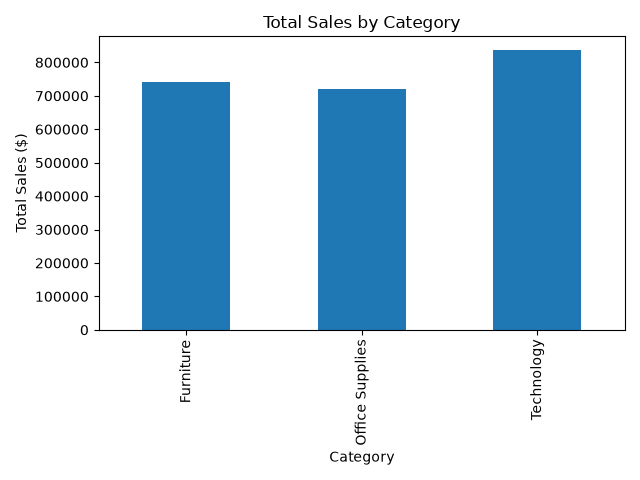
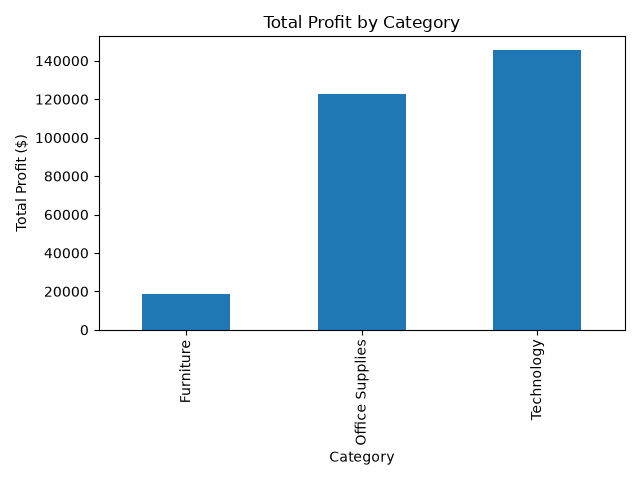
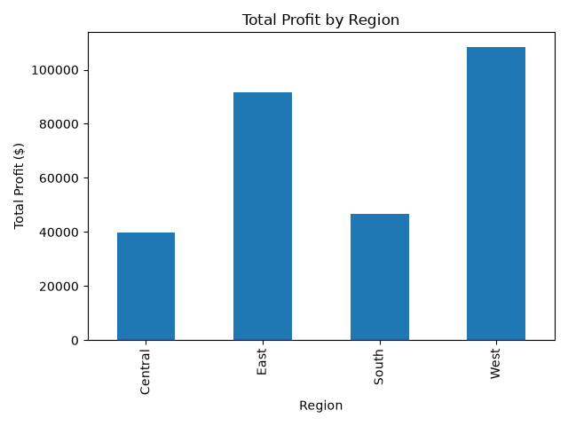
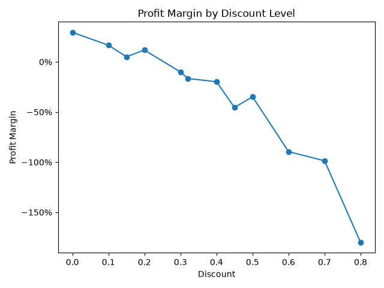
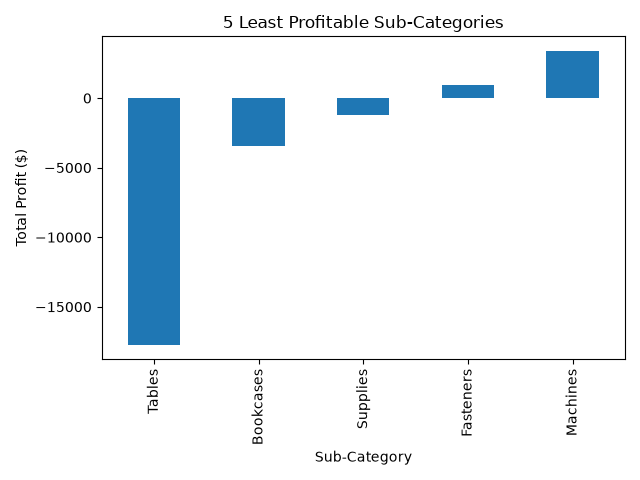
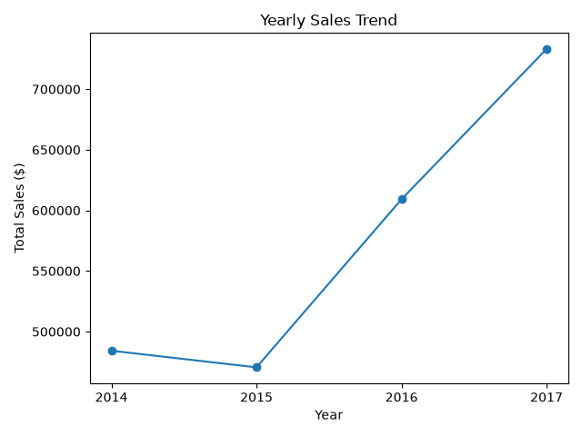
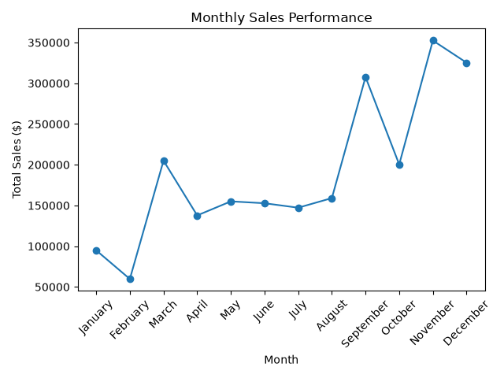
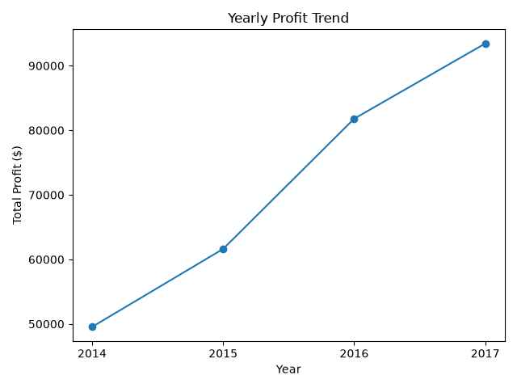

# Retail Business Analytics

Python • SQL • Pandas • Matplotlib • Power BI • DAX • SQLite

## Project Overview

Analyzed 9,994 retail transactions to identify sales trends, profitability drivers, regional performance, discount impacts, and changes in business performance over time.

This project uses Python, Pandas, SQL, data visualization, and Power BI to transform raw retail data into actionable business insights and present key performance metrics through an interactive dashboard.

## Business Questions

This project investigates several questions:

- Which product categories generate the most sales?
- Which categories generate the most profit?
- Which regions are the most profitable?
- How does discounting affect profit margins?
- Which product sub-categories are losing money?
- Which sub-categories generate the highest profits?
- How have sales and profits changed over time?
- Which months generate the highest sales and profit?

## Technologies

- Python
- Pandas
- NumPy
- Matplotlib
- SQL
- SQLite
- SQLAlchemy
- Power BI
- DAX
- Git / GitHub

## Key Findings

### Overall Performance

- Total sales: $2.30M
- Total profit: $286.4K
- Overall profit margin: 12.47%
- Total quantity sold: 37,873

### Category Performance

Technology generated the highest sales ($836.2K) and highest profit ($145.5K).

Furniture generated $742.0K in sales but only $18.5K in profit, resulting in a significantly lower profit margin of 2.49%.

### Regional Performance

The West region generated the highest total profit at approximately $108.4K, followed by the East at $91.5K.

### Discount Analysis

Higher discount levels were associated with significantly lower profitability. Discount levels of 30% or higher consistently resulted in negative profit margins in the analyzed dataset.

### Sub-Category Performance

Tables were the largest source of sub-category losses, generating approximately $17.7K in negative profit. Bookcases were the second-largest loss-producing sub-category at approximately $3.5K.

### Time-Series Performance

Sales decreased 2.83% in 2015 before increasing 29.47% in 2016 and 20.36% in 2017.

2017 generated the highest annual sales ($733.2K) and profit ($93.4K), while 2016 produced the highest annual profit margin at 13.43%.

November generated the highest monthly sales at approximately $352.5K, while December generated the highest monthly profit at approximately $43.4K.

## Power BI Dashboard

Developed an interactive Power BI dashboard to monitor retail sales and profitability and allow users to explore performance across product categories and geographic regions.

### Dashboard Features

- Total Sales KPI
- Total Profit KPI
- Profit Margin KPI
- Total Quantity Sold KPI
- Sales by Category
- Profit by Category
- Profit by Region
- Profit Margin by Discount Level
- Interactive Category slicer
- Interactive Region slicer

### DAX Measures

A custom DAX measure was created to calculate profit margin dynamically:

```DAX
Profit Margin = DIVIDE(SUM(Orders[Profit]), SUM(Orders[Sales]))
```

The dashboard enables interactive filtering to compare business performance across categories and regions and investigate the relationship between discounting and profitability.

The Power BI report file is available in the `powerbi/` directory.

## Visualizations

Python and Matplotlib were used to create visualizations supporting the exploratory, profitability, and time-series analysis.

### Sales by Category



### Profit by Category



### Profit by Region



### Discount vs. Profitability



### Least Profitable Sub-Categories



### Yearly Sales Trend



### Monthly Sales Trend



### Yearly Profit Trend



## Project Structure

```text
retail-business-analytics/
│
├── data/
│   └── raw/
│       └── sample_-_superstore.xls
│
├── outputs/
│   ├── sales_by_category.png
│   ├── profit_by_category.png
│   ├── profit_by_region.png
│   ├── discount_profitability.png
│   ├── worst_subcategories.png
│   ├── yearly_sales_trend.png
│   ├── monthly_sales_trend.png
│   └── yearly_profit_trend.png
│
├── powerbi/
│   └── retail_business_dashboard.pbix
│
├── src/
│   ├── explore_data.py
│   ├── run_sql.py
│   ├── visualize_data.py
│   └── time_analysis.py
│
├── .gitignore
└── README.md
```

## How to Run

### 1. Clone the repository

```bash
git clone https://github.com/samtekele/retail-business-analytics.git
cd retail-business-analytics
```

### 2. Install dependencies

```bash
pip install pandas numpy matplotlib seaborn openpyxl sqlalchemy xlrd
```

### 3. Run the exploratory data analysis

```bash
python src/explore_data.py
```

### 4. Generate visualizations

```bash
python src/visualize_data.py
```

### 5. Run the SQL analysis

```bash
python src/run_sql.py
```

### 6. Run the time-series analysis

```bash
python src/time_analysis.py
```

### 7. Open the Power BI dashboard

Open the following file using Power BI Desktop:

```text
powerbi/retail_business_dashboard.pbix
```

## Future Improvements

- Add customer segmentation analysis
- Analyze shipping and fulfillment performance
- Add automated reporting
- Expand the SQL analysis with more advanced queries
- Add additional Power BI drill-down and filtering capabilities
- Develop forecasting models for future sales performance