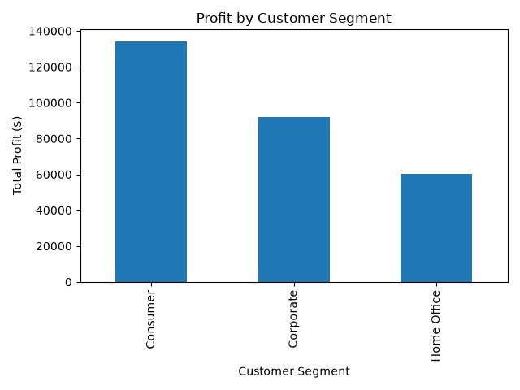
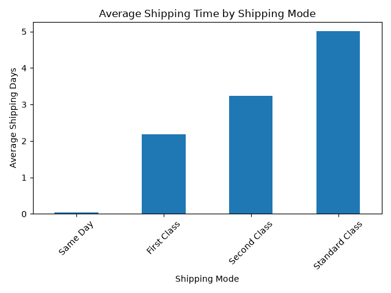
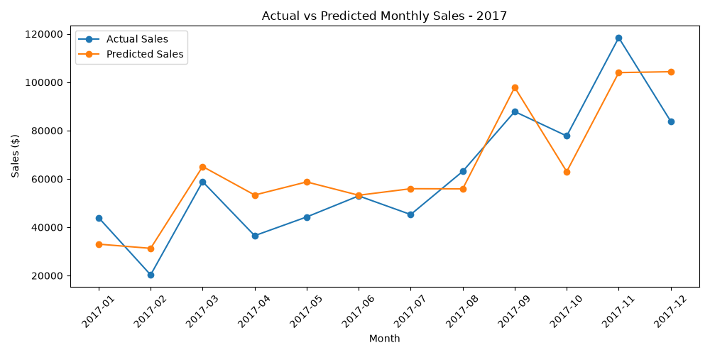
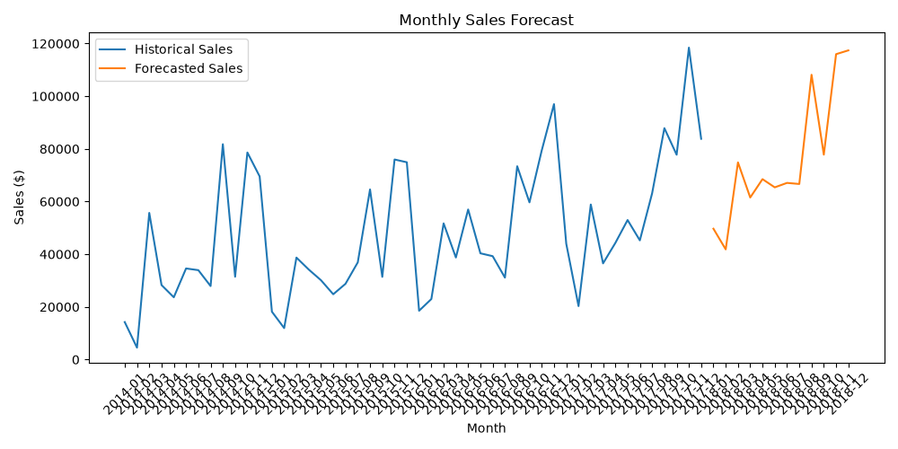

# Retail Business Analytics

Python • SQL • Pandas • Matplotlib • Power BI • DAX • SQLite

## Project Overview

Analyzed 9,994 retail transactions to evaluate sales trends, profitability, customer segments, regional performance, discount behavior, shipping operations, and changes in business performance over time.

This project uses Python, Pandas, SQL, SQLite, Matplotlib, Power BI, and DAX to transform raw retail data into actionable business insights. The analysis includes exploratory data analysis, intermediate SQL queries, customer and operational analysis, time-series analysis, and a Holt-Winters sales forecasting model.

The project also includes a two-page interactive Power BI report that provides an executive overview and deeper analysis of sales trends, customer profitability, and shipping performance.

## Business Questions

This project investigates several questions:

- Which product categories generate the most sales?
- Which categories generate the most profit?
- Which regions are the most profitable?
- How does discounting affect profit margins?
- Which product sub-categories are losing money?
- Which sub-categories generate the highest profits?
- How have sales and profits changed over time?
- Which months generate the highest sales and profit?
- Which customer segments generate the most profit and highest profit margins?
- How does shipping mode affect order-to-ship time?
- Which shipping methods are used most frequently?
- Can historical sales trends and seasonality be used to forecast future monthly sales?

## Technologies

- Python
- Pandas
- NumPy
- Matplotlib
- SQL
- SQLite
- SQLAlchemy
- Power BI
- DAX
- Statsmodels
- Scikit-learn
- Git / GitHub

## Key Findings

### Overall Performance

- Total sales: $2.30M
- Total profit: $286.4K
- Overall profit margin: 12.47%
- Total quantity sold: 37,873

### Category Performance

Technology generated the highest sales ($836.2K) and highest profit ($145.5K).

Furniture generated $742.0K in sales but only $18.5K in profit, resulting in a significantly lower profit margin of 2.49%.

### Regional Performance

The West region generated the highest total profit at approximately $108.4K, followed by the East at $91.5K.

### Discount Analysis

Higher discount levels were associated with significantly lower profitability. Discount levels of 30% or higher consistently resulted in negative profit margins in the analyzed dataset.

### Sub-Category Performance

Tables were the largest source of sub-category losses, generating approximately $17.7K in negative profit. Bookcases were the second-largest loss-producing sub-category at approximately $3.5K.

### Time-Series Performance

Sales decreased 2.83% in 2015 before increasing 29.47% in 2016 and 20.36% in 2017.

2017 generated the highest annual sales ($733.2K) and profit ($93.4K), while 2016 produced the highest annual profit margin at 13.43%.

November generated the highest monthly sales at approximately $352.5K, while December generated the highest monthly profit at approximately $43.4K.

### Customer Performance

The Consumer segment generated the highest total sales ($1.16M) and total profit ($134.1K).

Home Office produced the highest profit margin at 14.03%, followed by Corporate at 13.03% and Consumer at 11.55%. This shows that the segment generating the most total profit was not necessarily the most profitable relative to sales.

### Shipping & Operations

Standard Class was the most frequently used shipping mode with 2,994 unique orders, followed by Second Class (964), First Class (787), and Same Day (264).

Average order-to-ship time varied significantly by shipping mode. Standard Class averaged 5.01 days, Second Class 3.24 days, First Class 2.18 days, and Same Day 0.04 days.

First Class produced the highest profit margin among shipping modes at approximately 13.93%, although the analysis does not establish that shipping speed caused differences in profitability.

### Sales Forecasting

A Holt-Winters Exponential Smoothing model was developed using monthly sales data to capture historical trend and annual seasonality.

The model was trained on 2014–2016 sales and evaluated against actual 2017 sales. It achieved a Mean Absolute Error (MAE) of approximately $11.5K per month and a Mean Absolute Percentage Error (MAPE) of 22.59%.

After evaluation, the model was retrained using all available 2014–2017 data to generate a 12-month sales forecast for 2018. The forecast is intended as a baseline demonstration of time-series forecasting rather than a production-level prediction.

## Power BI Dashboard

Developed a two-page interactive Power BI report to monitor overall retail performance and provide deeper analysis of sales trends, customer profitability, and shipping operations.

The Executive Overview provides high-level KPIs and profitability analysis, while the Business Insights page focuses on time-series trends, customer segments, and shipping performance.

### Dashboard Features

**Executive Overview**

- Total Sales KPI
- Total Profit KPI
- Profit Margin KPI
- Total Quantity Sold KPI
- Sales by Category
- Profit by Category
- Profit by Region
- Profit Margin by Discount Level
- Interactive Category and Region slicers

**Business Insights**

- Monthly Sales Trend
- Monthly Profit Trend
- Profit by Customer Segment
- Profit Margin by Customer Segment
- Orders by Shipping Mode
- Average Order-to-Ship Time by Shipping Mode
- Interactive Shipping Mode slicer

### DAX Measures

A custom DAX measure was created to calculate profit margin dynamically:

```DAX
Profit Margin = DIVIDE(SUM(Orders[Profit]), SUM(Orders[Sales]))
```

A calculated column was also created to measure the number of days between the order date and ship date:

```DAX
Shipping Days = DATEDIFF(Orders[Order Date], Orders[Ship Date], DAY)
```

The dashboard enables interactive filtering to compare business performance across categories, regions, customer segments, and shipping modes.

The Power BI report file is available in the `powerbi/` directory.

## Visualizations

Python and Matplotlib were used to create visualizations supporting the exploratory, profitability, time-series, customer, shipping, and forecasting analyses.

### Sales by Category


### Profit by Category


### Profit by Region


### Discount vs. Profitability


### Least Profitable Sub-Categories


### Yearly Sales Trend


### Monthly Sales Trend


### Yearly Profit Trend


### Profit by Customer Segment



### Average Shipping Time by Mode



### Actual vs Predicted Sales



### Monthly Sales Forecast



## Project Structure

```text
retail-business-analytics/
│
├── data/
│   └── raw/
│       └── sample_-_superstore.xls
│
├── outputs/
│   ├── sales_by_category.png
│   ├── profit_by_category.png
│   ├── profit_by_region.png
│   ├── discount_profitability.png
│   ├── worst_subcategories.png
│   ├── yearly_sales_trend.png
│   ├── monthly_sales_trend.png
│   ├── yearly_profit_trend.png
│   ├── profit_by_customer_segment.png
│   ├── shipping_time_by_mode.png
│   ├── actual_vs_predicted_sales.png
│   ├── monthly_sales_forecast.png
│   └── 2018_sales_forecast.csv
│
├── powerbi/
│   └── retail_business_dashboard.pbix
│
├── src/
│   ├── explore_data.py
│   ├── run_sql.py
│   ├── visualize_data.py
│   ├── time_analysis.py
│   ├── customer_analysis.py
│   ├── shipping_analysis.py
│   └── sales_forecast.py
│
├── .gitignore
└── README.md
```

## How to Run

### 1. Clone the repository

```bash
git clone https://github.com/samtekele/retail-business-analytics.git
cd retail-business-analytics
```

### 2. Install dependencies

```bash
pip install pandas numpy matplotlib seaborn openpyxl sqlalchemy xlrd statsmodels scikit-learn
```

### 3. Run the exploratory data analysis

```bash
python src/explore_data.py
```

### 4. Generate visualizations

```bash
python src/visualize_data.py
```

### 5. Run the SQL analysis

```bash
python src/run_sql.py
```

### 6. Run the time-series analysis

```bash
python src/time_analysis.py
```

### 7. Run the customer analysis

```bash
python src/customer_analysis.py
```

### 8. Run the shipping analysis

```bash
python src/shipping_analysis.py
```

### 9. Run the sales forecasting analysis

```bash
python src/sales_forecast.py
```

### 10. Open the Power BI dashboard

Open the following file using Power BI Desktop:

```text
powerbi/retail_business_dashboard.pbix
```

## Future Improvements

- Add automated reporting and scheduled dashboard refresh workflows
- Incorporate external business factors such as promotions, holidays, and economic conditions into forecasting models
- Expand forecasting with additional models and compare performance using multiple evaluation metrics
- Add more advanced Power BI drill-through pages and detailed product-level analysis
- Build a more formal data pipeline for cleaning, storing, and refreshing new retail data
- Add additional customer-level analysis to identify purchasing patterns and higher-value customer groups